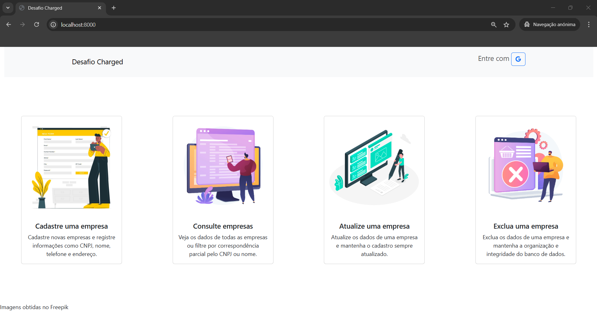
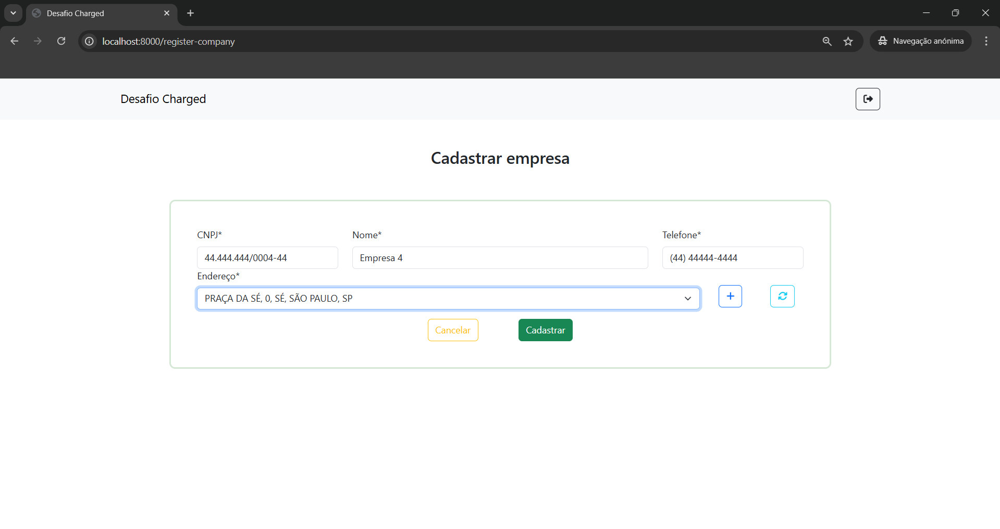
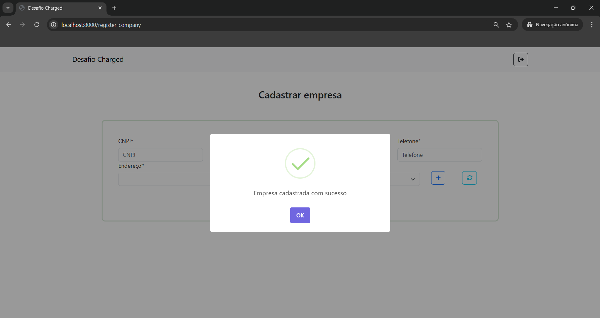
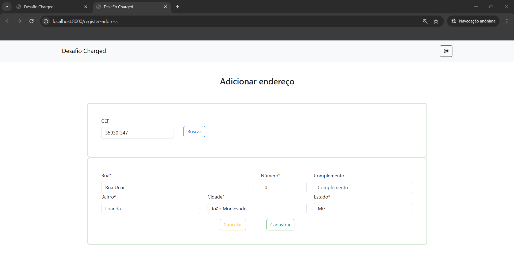
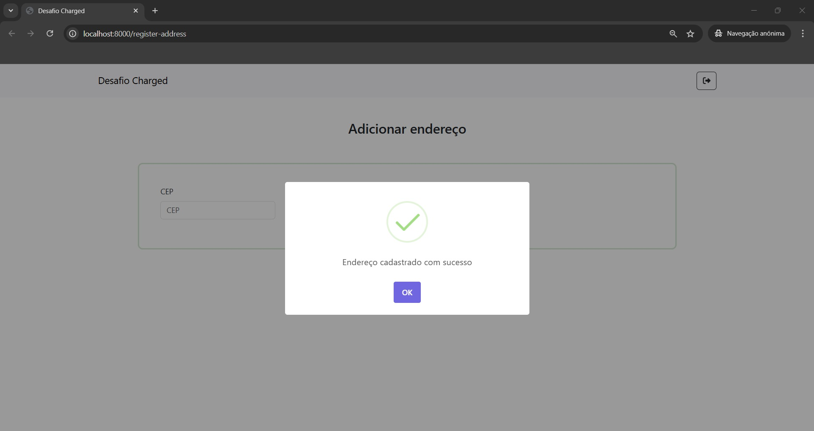
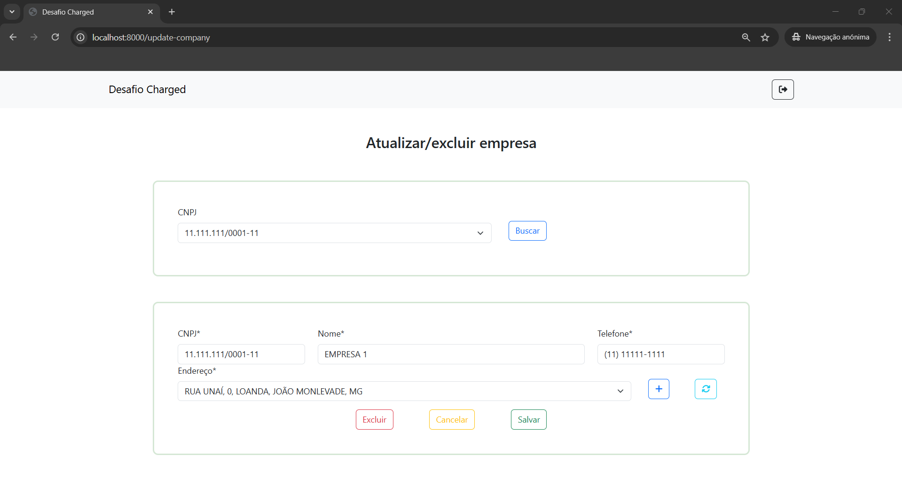
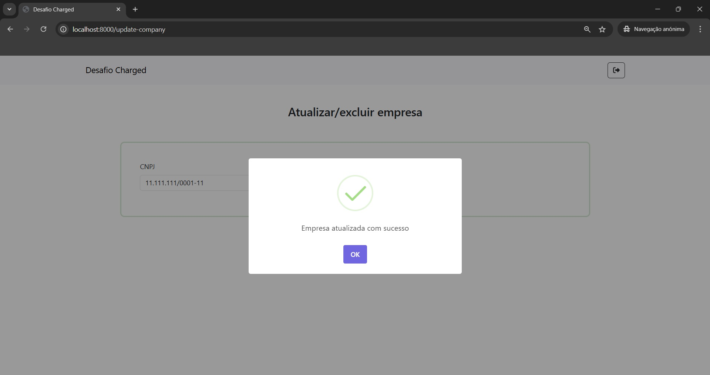
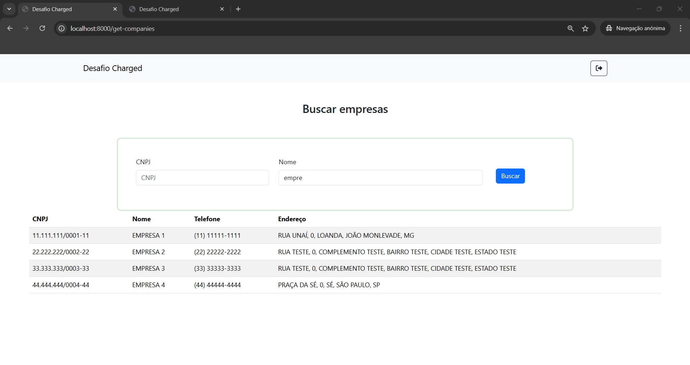

# Teste Técnico para Vaga na Charged Cloud

## Objetivo
Desenvolver uma aplicação web utilizando Nest.js, Vite e MySQL que permita gerenciar (cadastrar, consultar, atualizar e excluir) empresas.

<br></br>
## Tabela de Conteúdos

1. [Especificação das Telas por Histórias de Usuário](#Especificação-das-Telas-por-Histórias-de-Usuário)
	- [Início](#Título-Tela-inicial)
	- [Painel de Controle](#Título-Tela-Painel-de-Controle)
	- [Cadastro de Empresa](#Título-Tela-Cadastro-de-Empresa)
	- [Consulta de Empresas](#Título-Tela-Consulta-de-Empresas)
	- [Atualização/deleção de Empresa](#Título-Tela-atualizaçãodeleção-de-empresa)
	- [Cadastro de Endereço (⭐ EXTRA)](#Título-Tela-Cadastro-de-Endereço--Extra)
	- [Especificação completa das histórias de usuário (Trello)](##-A-especificação-das-histórias-de-usuário-e-a-gestão-dos-cards-foram-realizadas-no-trello-e-podem-ser-acessadas-aqui)
2. [Definição de Protótipo de Telas de Baixa Fidelidade](#Definição-de-Protótipo-de-Telas-de-Baixa-Fidelidade)
3. [Tecnologias](#Tecnologias)
4. [Resultados](#Resultados)
5. [Instruções de Instalação e Execução do Projeto Localmente](#Instruções-de-Instalação-e-Execução-Localmente)

</br></br>
# Especificação das Telas por Histórias de Usuário
Com base na especificação da aplicação, foi possível obter as seguintes histórias de usuário para as telas:

### Título: Tela Inicial

Como **usuário**

eu quero **acessar uma tela inicial**

para **visualizar o botão de login**

**Critério (s) de aceitação:**

1. A tela inicial deve ter um botão de login, que redireciona para o login com a conta do Google.


### Título: Tela Painel de Controle

Como **usuário autenticado**

eu quero **acessar uma tela de painel de controle**

para **visualizar os botões com as funcionalidades do sistema**

**Critério (s) de aceitação:**

1. Apenas usuários autenticados podem acessar a tela de painel de controle.


### Título: Tela Cadastro de Empresa

Como **usuário autenticado**

eu quero **acessar uma tela de cadastro de empresa**

para **adicionar os dados de um nova empresa ao banco de dados**

**Critério (s) de aceitação:**

1. Os campos CNPJ, nome, telefone e endereço devem ser sinalizados como obrigatórios;

2. Nessa tela, o usuário deve ser capaz de visualizar todos os endereços cadastrados e escolher entre um deles. Caso nenhum seja o endereço que o usuário deseja, ele deve ser capaz de cadastrar um novo; 

3. Ao submeter o cadastro, o usuário deve receber uma mensagem de confirmação do cadastro ou de erro;

4. Apenas usuários autenticados podem cadastrar empresa.


### Título: Tela Consulta de Empresas

Como **usuário autenticado**

eu quero **acessar uma tela de consulta de empresas e filtrar por CNPJ ou por nome**

para **consultar uma empresa pelo CNPJ ou nome**

**Critério (s) de aceitação:**

1. Se nenhum critério de filtragem for informado, o usuário deve receber os dados de todas as empresas. Caso contrário, deve receber os dados das empresas de acordo com os critérios informados.

2. Apenas usuários autenticados podem consultar empresa.


### Título: Tela atualização/deleção de empresa

Como **usuário autenticado**

eu quero **acessar uma tela para atualizar ou excluir uma empresa**

para **alterar ou excluir os dados de uma empresa cadastrada**

**Critério (s) de aceitação:**

1. O usuário deve ser capaz de buscar por uma empresa em uma lista com todas as empresas cadastradas;

2. Após selecionar uma empresa, os seus dados devem ser exibidos em caixas de texto editáveis;

3. Nessa tela, o usuário deve ser capaz de visualizar todos os endereços cadastrados e escolher entre um deles. Caso nenhum seja o endereço que o usuário deseja, ele deve ser capaz de cadastrar um novo;

4. Ao submeter uma atualização, o usuário deve receber uma mensagem de confirmação ou de erro;

5. Ao submeter uma exclusão, o usuário deve receber uma mensagem de confirmação ou erro;

6. Apenas usuários autenticados podem atualizar empresa.


### Título: Tela Cadastro de Endereço (⭐ EXTRA)

Como **usuário autenticado**

eu quero **cadastrar um endereço**

para **que ele fique disponível para seleção nas telas de cadastro e atualização de empresas**

**Critério (s) de aceitação:**

1. Apenas usuários autenticados podem cadastrar endereço.

#### 🔗 A especificação das histórias de usuário e a gestão dos cards foram realizadas no Trello e podem ser acessadas [aqui](https://trello.com/invite/b/67448e0ab25d7dcb3c4d8d93/ATTI0386bf734a70346694002266db0efef1F5A0EF2B/desafio-charged-cloud-frontend).


<br></br>
# Definição de Protótipo de Telas de Baixa Fidelidade
🔗 O protótipo de telas de baixa fidelidade foi construído no Figma e pode ser acessado [aqui](https://www.figma.com/design/OlhnH5u8f7X2VFJ62HEiV2/Desafio-Charged---Prot%C3%B3tipo-de-Baixa-Fidelidade-das-Telas?m=auto&t=q4svdKCA3YxjjR1Y-6).


<br></br>
# Tecnologias
- Projeto React com Vite e Typescript;
- React-Bootstrap.

# Resultados


















<br></br>
# Instruções de Instalação e Execução Localmente

## Instalando o backend
1. Acesse o repositório disponível [aqui](https://github.com/danielosilva1/desafio-charged-cloud-backend) e siga as instruções de instalação/execução disponíveis lá

## Instalando e executando o projeto
1. Clone o projeto para a sua máquina;
2. Instale as dependências do projeto;
3. Rode o projeto
    
    No diretório raiz, execute:
    ```
    npm run dev
    ```
5. Execute o projeto

    No navegador, acesse: [http://localhost:8000](http://localhost:8000)